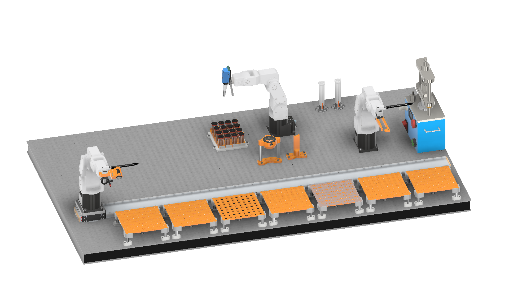

# :battery: + :robot: + 🧠 + 🏭 = AutoBASS 2.0
AutoBASS deploys Automated Battery Assembly System. The development of this system is intended to fully automate the assembly procedure of CR2032 coin cell in the field of battery research, in comparision to the pilot production line of industrial scale, this agile automated system will free researchers from the tedious cell assembly work and provide the possibility of producing full cells with "in house-made" electrochemistry in a labortory scale, therefore to faciliate and accelerate the data-driven studies in optimizing of electrochemistry and cycling protocol. The improved version of the system namely AutoBASS 2.0 has integrated the imaging system which makes it possible to live correct the misplacment of each components, therefore, futher increases the reproducibilty and success rate of the cell manufacturing. The newly built multi-chanale electrolyte dispersion station also makes a combinatorial electrolyte sythesis possible.



## Data
Please go to zenodo at [Additive research data](https://zenodo.org/records/11060629). There you will find 3 zip files which you need to download and unzip:
1. Base.zip
2. FEC.zip
3. VC.zip

After unziping them, you will get three folders each with 2 subfolders namely "1mAh" and "3mAh" which corresponds to the two cell batches using area capacity of 1mAh/cm2 and 3mAh/cm2 respectively and each subfolder contains folders named with the information of cell number, mass ratio and additive name of individual cell, in which the cycling data is saved as .CSV  file that you can read in python via:
```python
import pandas as pd
data = pd.read_csv(r"...the/file/path/of/your/.csv")
```
Here you need to replace the path with the actual path of .csv files on your PC. We did this using python 3.9 so make sure you're not using an outdated version.
Then the data variable will contain all data for the specific cell (failed or not) as a dictionary with essentially the raw data what arbin spits out, bassically, we listed the following keys to the data that are most often used:

Keys: Test_Time(s), Voltage(V), Current(A), Cycle_Index, Step_Index

#### Example Data access:

For example, you want to see the voltage profile of the cell:

```python
import matplotlib.pyplot as plt
import pandas as pd
data = pd.read_csv(r"...the/file/path/of/your/.csv")

plt.plot(data['Test_Time(s)'],data['Voltage(V)'])
plt.xlabel('Time [s]')
plt.ylabel('Voltage [V]')
```

## Setup design
The whole system consists of three action units:
1. Assembly unit: 6-axis robotic arms (Mecademic meca500 rev.2) + Linear rail (Jenny Science Linax LXS 1800)
2. Electrolyte unit: 6-axis robotic arms (Mecademic meca500 rev.2) + computer-controlled dispensing module (Sartorius rLINE® 1-ch 200 µl)
3. Sealing unit: 6-axis robotic arms (Mecademic meca500 rev.2) + Hydraulic coin cell crimping machine (MTI MSK-160E, China)
Following the standard procedure of CR2032 cell assembly recommonded by collaborator from the BIG-MAP project, stacking sequence will be starting from the positive case to the negative case as shown in the Figure below. An user interface based on python tkinter is developed to faciliate the operation of the system. Two high-resolution webcams (on the robot and next to the building stage) are integrated to provide imaging data of the components.


### What's new
In comparision to the previous version of AutoBASS, new features have been developed in the AutoBASS 2.0:
1. New electrolyte dispersing unit: can choose from up to 16 different electrolytes without cross-contamination
2. Multi-threading operation: perfom pick-and-place, crimping and despersing in synchornized manner
3. Active-imaging: misgrab detection and self-correction
4. New UI: more user-friendly, easy to assgin assembly task

### How to use
#### Prepearation
Prepare your materials and components prior to the assembly:
1. Inactive Components (Anode case, spacer, washer, cathode case) need to be washed in an ultrasonic bath with isopropanol alcohol for 15 mins, dry in the fume hood over 2 hrs and put in the drying oven at 80°C overnight.
2. Active components (Electrodes, separator) need to be cut into specific sizes in the glovebox:
   cathode: 14 mm
   anode: 15 mm
   separator: 16 mm
3. Placing compoents onto the tray

4. Electrolyte:


#### Launch script
The user interface will guide you through the procedure from scratch:

1. Launch 'AutoBass_v2.py'
2. Click “Assembly Coin Cell”
3. Click "Initialize system" and wait for the progress bar to finish
4. Click “Setup Cells” and go to "Manually Setup"
5. Check the number(s) of cell(s) you want to start and electrolyte number to disperse, click "Save"
6. Click "Start Assembly" and the procedure will start

### To build up your own
Have a look at the stl files in the mechanical parts folder.
You will need
1. A Crimper
2. 3x Mecademic Meca 500 r.3
3. 2x Meca compatible Schunk Grippers
4. Jenny Science Linax Linear rail
5. Satorius rLine dispensing module rLINE® 1-ch 200 µl
6. A powerful vacuum pump
7. 2x 2/2 way Solenoid valve
8. Ardurino Uno + Relay schield
9. Optical table
10. A 3D printer
11. Possibly our help
12. A very large glovebox

Please reach out to us if you are planning to set one up in your lab as there are some practical issues to be considered like the Athmosphere of your glovebox. We recommend to not use Argon as robots can fail very fast due to overheating issues. The GUI Bojing wrote makes a lot of the aligning tasks a lot easier (you will need this too).

Consider getting a glovebox with forced laminar flow as otherwise there can be issues of trapped gases.

The crimper is typically quite heavy and does not need to be fixed additonally. Overall you "just" need to assemble all parts and teach the robot the positions. We taught the robot ALL prositions manually.


## Lurking
Have a look at the data or code then? Or read the paper which ist published at [JOURNAL]

## Motivation
In battery research, most of the "in-house" made cells were still manually assembled. The cell-to-cell variance during manufacturing processe strongly impacts the overall performance of the system in data-driven stuides, therefore, we see it a pressing need to produce full-cells in a way of resonable reproducibilty and lab-scaled productivity. We therefore developed the automatic battery assembly system (AutoBASS) which is capable of producing a whole batch of up to 64 CR2032 coin cells.

## Enviroment setup
AutoBASS is very easy-to-read and user-friendly,  besides hardware drivers you just need a working python 3.7 installation and the drivers for the corresponding hardware as well. If you are using mecademic robots you need to install their (awesome!) python driver too.


## Acknowledgements

This project has received funding from the European Union’s [Horizon 2020 research and innovation programme](https://ec.europa.eu/programmes/horizon2020/en) under grant agreement [No 957189](https://cordis.europa.eu/project/id/957189).
